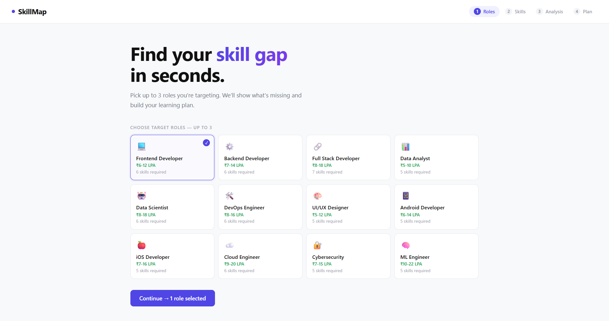
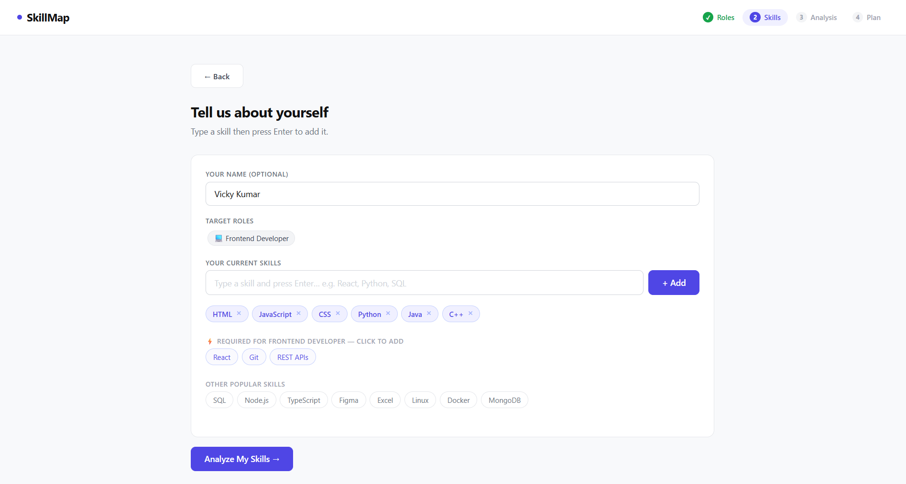
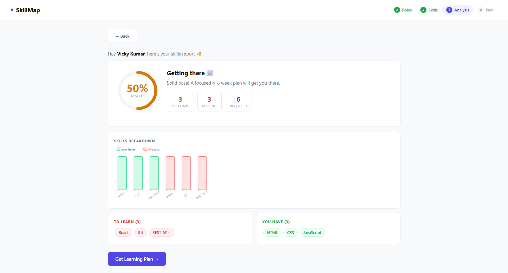

# 🗺️ SkillMap — Job Skills Gap Analyzer

A clean, interactive web app that helps you **find your skill gap** and get a **personalized 4-week learning roadmap** for your target tech career — in seconds.

> Built with vanilla React (no build tools), plain HTML/CSS/JS · Deployed on GitHub Pages

---

## 🖼️ Preview

### Step 1 — Choose Your Target Roles


### Step 2 — Enter Your Current Skills


### Step 3 — Skills Gap Analysis


### Step 4 — Your 4-Week Learning Plan
.png)

.png)

.png)

---

## ✨ Features

- 🎯 **Role Selector** — Choose up to 3 target roles (Frontend Dev, Data Scientist, DevOps, and 9 more)
- 🧠 **Skill Gap Engine** — Compares your skills against role requirements and calculates a match score
- 📊 **Visual Analysis** — Circular score meter + bar chart showing skills you have vs. what's missing
- 🗓️ **4-Week Roadmap** — Auto-generated weekly plan with curated free resources (YouTube, docs, interactive courses)
- ✅ **Progress Tracking** — Check off weeks as you complete them; watch the progress bar fill up
- ✨ **AI-Powered Plan** *(optional)* — Paste a free Gemini API key to get a personalized AI roadmap
- 📱 **Responsive** — Works on desktop and mobile

---

## 🚀 Live Demo

> [🔗 View on GitHub Pages](https://vickykumar03.github.io/skill-gap-analyzer/)

---

## 🛠️ Tech Stack

| Technology | Usage |
|---|---|
| HTML5 | App shell (`index.html`) |
| CSS3 | Custom styling (`style.css`) |
| React 18 (UMD/CDN) | UI components, state management |
| Vanilla JavaScript | App logic, gap calculation (`script.js`) |
| Gemini API (optional) | AI-generated roadmap |

No npm, no bundler, no build step — just open `index.html` in a browser.

---

## 📁 Project Structure

```
skill-gap-analyzer/
├── index.html          # App entry point
├── style.css           # All styles
├── script.js           # React components + app logic
├── Page1.png           # Screenshot – Role selection
├── Page2.png           # Screenshot – Skills input
├── Page3.png           # Screenshot – Analysis
├── Page4(normal).png   # Screenshot – Learning plan
├── Page4(Updated).png  # Screenshot – Progress tracking
└── Page4(Below).png    # Screenshot – AI plan section
```

---

## ⚙️ How to Run Locally

```bash
# 1. Clone the repo
git clone https://github.com/Vickykumar03/skill-gap-analyzer.git

# 2. Open the project folder
cd skill-gap-analyzer

# 3. Open index.html in your browser
# (No server needed — it just works!)
open index.html       # macOS
start index.html      # Windows
xdg-open index.html   # Linux
```

---

## 🎮 How It Works

1. **Pick Roles** — Select up to 3 job roles you're targeting (e.g. Full Stack Developer, Data Scientist)
2. **Add Your Skills** — Type your current skills or click quick-add suggestions
3. **See Your Gap** — Get a match score, a breakdown chart, and lists of what you have vs. what's missing
4. **Follow the Plan** — Get a 4-week curated roadmap with free resources and project ideas for each skill
5. *(Optional)* **AI Plan** — Enter a free [Gemini API key](https://ai.google.dev) to generate a personalized AI roadmap

---

## 🤖 AI Feature (Gemini)

The app supports AI-generated roadmaps via Google's Gemini 2.0 Flash model.

1. Get a **free** API key at [ai.google.dev](https://ai.google.dev) (no credit card needed)
2. On the Plan page, paste your key and click **Generate →**
3. Your personalized roadmap will replace the static one

---

## 📚 Supported Job Roles

| Role | Salary Range |
|---|---|
| 💻 Frontend Developer | ₹6–12 LPA |
| ⚙️ Backend Developer | ₹7–14 LPA |
| 🔗 Full Stack Developer | ₹8–18 LPA |
| 📊 Data Analyst | ₹5–10 LPA |
| 🤖 Data Scientist | ₹8–18 LPA |
| 🛠️ DevOps Engineer | ₹8–16 LPA |
| 🎨 UI/UX Designer | ₹5–12 LPA |
| 📱 Android Developer | ₹6–14 LPA |
| 🍎 iOS Developer | ₹7–16 LPA |
| ☁️ Cloud Engineer | ₹9–20 LPA |
| 🔐 Cybersecurity | ₹7–15 LPA |
| 🧠 ML Engineer | ₹10–22 LPA |

---

## 🙋‍♂️ Author

**Vicky Kumar**  
[GitHub @Vickykumar03](https://github.com/Vickykumar03)

---

## 📄 License

This project is open source and available under the [MIT License](LICENSE).

---

> ⭐ If you found this useful, consider giving the repo a star!
